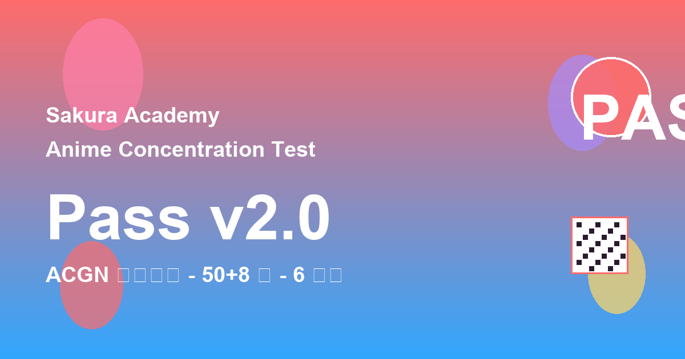

# 二次元浓度研究所 · 樱花街机学院版



## 项目简介

**二次元浓度研究所**是一款二次元知识测试 Web 应用，通过 226 道精心设计的题目，从番剧、游戏、声优、梗文化、综合常识五个维度全面评估用户的二次元浓度，并生成专属次元通行证。

### 核心功能

- 🎮 **三种挑战模式**：轻松模式（10题）、标准模式（15题）、困难模式（20题）
- 📊 **双计分系统**：知识掌握度（百分制）+ 竞技表现（速度分+连击分）
- 🎯 **能力雷达**：五维能力画像，直观展示各维度水平
- 🎭 **角色匹配**：根据答题表现匹配二次元角色
- 🏆 **成就系统**：40+ 成就徽章，记录你的二次元之旅
- 📜 **历史记录**：完整的答题历史与成绩对比
- 📤 **社交分享**：生成通行证海报与二维码

## 视觉风格

采用 **樱花街机学院** 设计语言：
- 厚描边卡片 + 硬边阴影
- 糖果色配色系统
- 游戏关卡式界面布局
- 完整的响应式适配

## 技术栈

- **前端**：原生 HTML5 / CSS3 / JavaScript
- **图标**：Emoji + SVG
- **数据存储**：LocalStorage
- **字体**：ZCOOL KuaiLe（标题）+ M PLUS Rounded 1c（正文）

## 快速开始

### 本地运行

```bash
# 方式一：使用 Python 内置服务器
python -m http.server 8080

# 方式二：使用 Node.js
node server.js

# 方式三：直接双击 index.html（需本地服务器）
```

访问 http://localhost:8080/index.html 即可开始体验。

### 文件结构

```
traebisai/
├── index.html          # 主应用文件（单文件架构）
├── assets/
│   └── images/         # 题目配图资源
├── docs/
│   └── specs/          # 设计规范文档
├── .trae/
│   └── documents/      # TRAE 开发计划文档
└── README.md           # 项目说明
```

## 答题流程

1. **首页** → 点击「开始测试」
2. **模式选择** → 选择挑战难度
3. **答题挑战** → 依次回答题目
4. **结果结算** → 查看成绩、能力雷达、角色匹配
5. **分享/重试** → 生成通行证或再次挑战

## 无障碍支持

- ✅ 键盘导航（Tab / Enter / Space）
- ✅ 焦点可见（focus-visible）
- ✅ 减少动效（prefers-reduced-motion）
- ✅ ARIA 属性支持

## 开发记录

本项目全程使用 **TRAE AI 开发环境** 完成，包含以下关键阶段：

| 阶段 | 内容 | Session ID |
|------|------|------------|
| 稳定化改造 | 双计分系统、历史/成就/无障碍、小样本可信度 | `6a5707fa833005b0604dc9a2` |
| 主题令牌 | CSS 设计令牌与隔离层 | `6a576df6833005b0604dd31c` |
| 首页/模式 | 学院大厅风格首页、关卡挑战卡 | `6a576786833005b0604dd290` |
| 答题页 | 技能卡选项、HUD 状态栏、离开确认 | `6a576786833005b0604dd290` |
| 结果页 | 通关证书、能力雷达、角色卡 | `6a576786833005b0604dd290` |
| 弹窗统一 | 历史/成就/分享/重置确认 | `6a576786833005b0604dd290` |
| 响应式收口 | 三档断点、无障碍、动效优化 | `6a576786833005b0604dd290` |

## 许可证

MIT License

---

**二次元浓度研究所** · 樱花街机学院版
