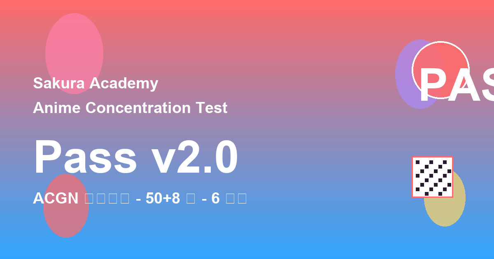
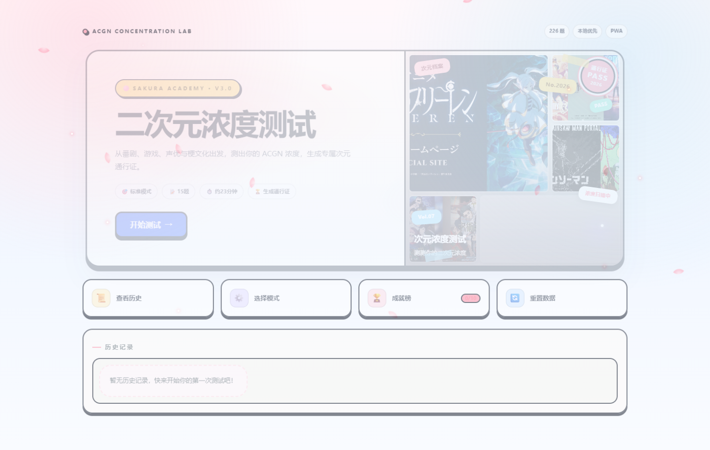
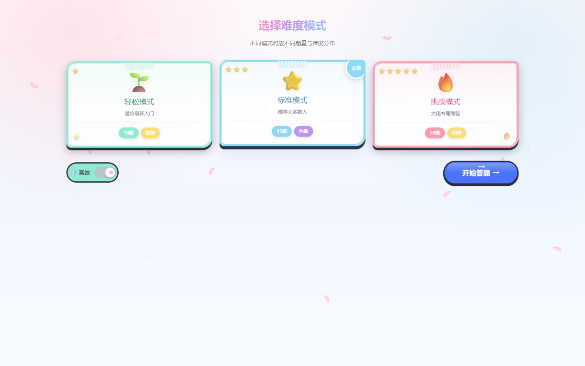
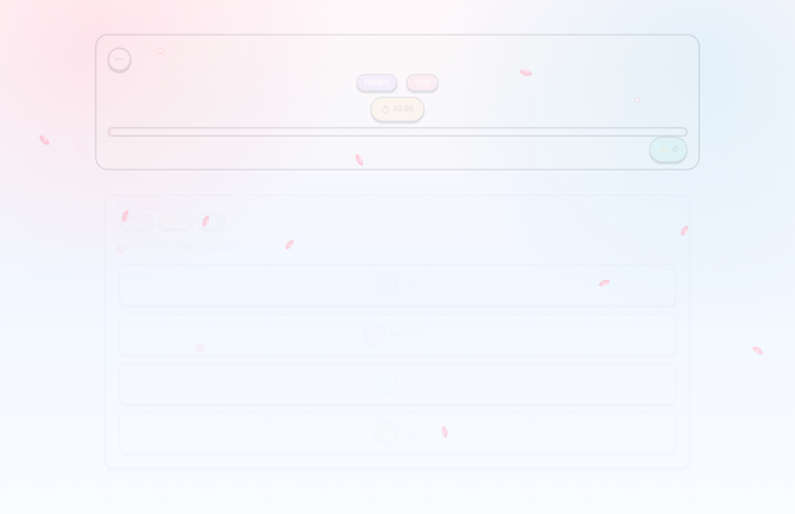
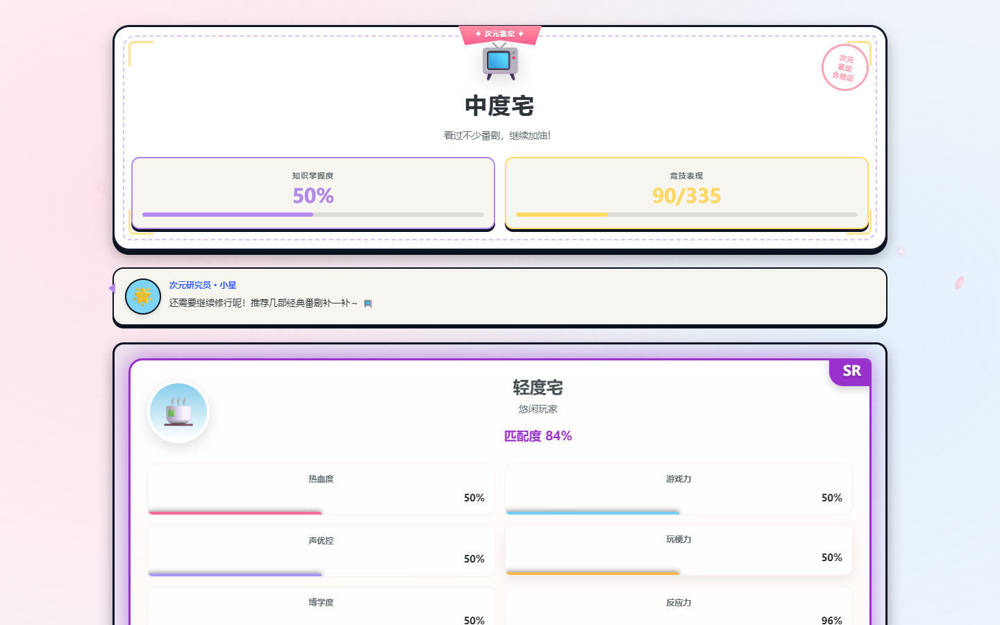

<div align="center">



# 二次元浓度研究所

**ACGN Concentration Lab · Sakura Arcade Academy**

一款原生 Web 打造的 ACGN 知识挑战应用：随机抽题、双计分、能力画像、角色匹配、成就记录与专属次元通行证。

[在线体验](https://luzxxxx.github.io/acgn-concentration-lab/) · [问题反馈](https://github.com/Luzxxxx/acgn-concentration-lab/issues)

</div>

## 项目亮点

- **226 道题库**：覆盖番剧、游戏、声优、梗文化与综合常识五类内容。
- **三种挑战模式**：轻松 10 题、标准 15 题、挑战 20 题，每类题目都有最低覆盖量。
- **双计分系统**：知识掌握度采用难度加权，竞技表现同时计算基础分、速度奖励与连击奖励。
- **个性化结果**：六维角色画像、20 个角色原型、段位、错题手账与解释。
- **本地优先**：历史、成就和设置仅保存在浏览器 `localStorage`，无需注册账号。
- **可安装 PWA**：支持离线回访、响应式布局、键盘操作和减少动效偏好。
- **可验证工程质量**：Vite 构建、Vitest 单元测试、ESLint、内容校验与 GitHub Actions。

## 界面预览

| 首页 | 模式选择 |
| --- | --- |
|  |  |

| 答题页 | 结果页 |
| --- | --- |
|  |  |

## 技术设计

项目保留原生 HTML、CSS 和 JavaScript，不引入运行时 UI 框架；Vite 只负责开发体验和生产构建。

```text
用户操作
   ↓
页面状态与 UI 渲染（src/main.js）
   ├── 抽题与选项洗牌（src/core/question-selector.js）
   ├── 计分与分类汇总（src/core/scoring.js）
   ├── 内容结构校验（src/core/content-validator.js）
   ├── 题库与配置（src/data/catalog.js）
   └── 角色数据（src/data/characters.js）
            ↓
      localStorage / Canvas / Web APIs
```

核心逻辑与 DOM 渲染分离后，可以在不启动浏览器的情况下验证抽题平衡、正确答案洗牌、计分边界和数据完整性。

## 快速开始

### 环境要求

- Node.js 22 或更高版本
- npm 10 或更高版本

### 安装与运行

```bash
git clone https://github.com/Luzxxxx/acgn-concentration-lab.git
cd acgn-concentration-lab
npm install
npm run dev
```

Windows 用户也可以双击 `start.bat`，脚本会在首次运行时安装依赖并启动开发服务器。

### 常用命令

| 命令 | 用途 |
| --- | --- |
| `npm run dev` | 启动 Vite 开发服务器 |
| `npm run test` | 运行 Vitest 单元测试 |
| `npm run lint` | 检查 JavaScript 代码 |
| `npm run validate:content` | 校验题库、角色与图片引用 |
| `npm run build` | 生成 `dist/` 生产构建 |
| `npm run preview` | 本地预览生产构建 |
| `npm run check` | 依次运行 lint、test 和 build |

## 目录结构

```text
.
├── .github/workflows/       # CI 与 GitHub Pages
├── docs/                    # 设计规格与实施记录
├── public/                  # PWA 文件和静态图片
├── scripts/                 # 发布前内容校验
├── screenshots/             # README 与演示截图
├── src/
│   ├── core/                # 可测试的纯逻辑模块
│   ├── data/                # 题库、配置和角色目录
│   ├── styles/              # 基础主题与 v3 精修层
│   └── main.js              # 页面状态、渲染与交互
├── tests/                   # Vitest 测试
├── index.html               # 应用 HTML 骨架
└── vite.config.js           # 构建与测试配置
```

## 测试范围

- 题库 ID、题型、分类、难度、选项、答案与音频文本完整性。
- 角色 ID、六维目标分数与匹配权重。
- 三种模式的题量、去重和最低分类覆盖。
- 洗牌后正确答案保持不变。
- 基础分、速度奖励、连击上限、知识百分比与段位边界。
- 真实浏览器中的首页 → 模式 → 10 题 → 结果页完整流程。

## 隐私与数据

应用没有后端，也不会上传答题历史。浏览器只在本地保存成绩、成就与声音设置；用户可以从首页随时清空这些数据。

## 第三方素材与免责声明

题图来自相关作品的官方公开页面，仅用于非商业知识测试与作品集演示。版权归各自权利方所有，来源记录见 [`public/assets/images/SOURCES.md`](./public/assets/images/SOURCES.md)。公开来源和署名不代表已获得再分发许可，商业使用前请替换素材或取得授权。

完整边界说明见 [THIRD_PARTY_ASSETS.md](./THIRD_PARTY_ASSETS.md)。本项目是娱乐性质测试，不构成科学、心理或能力评估，也与相关作品权利方无隶属、赞助或认可关系。

## 参与贡献

提交题目、修复或界面改进前，请阅读 [CONTRIBUTING.md](./CONTRIBUTING.md) 并运行 `npm run check`。

## 许可证

原创代码与原创素材采用 [MIT License](./LICENSE)。第三方图片、作品名称、角色与商标不包含在 MIT 授权范围内。
